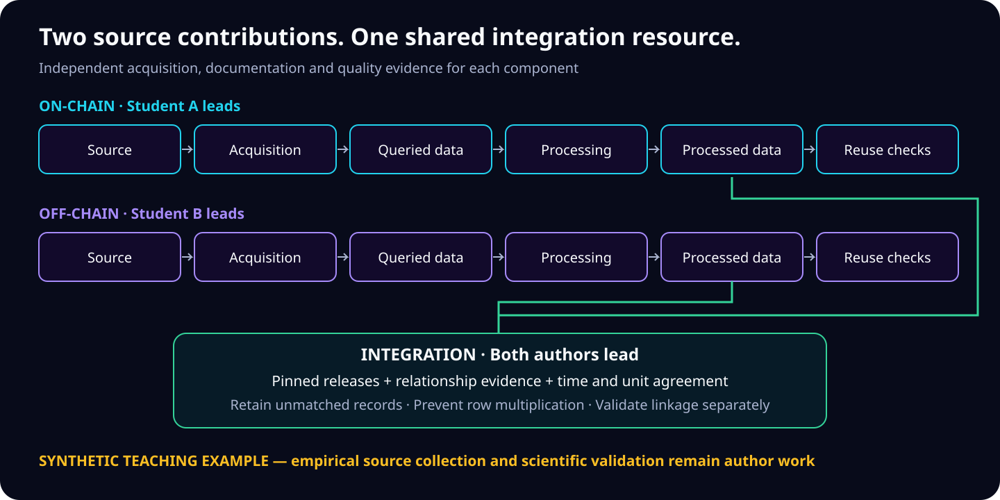

# Web3AI4IO-SD-Template

**A Scientific Data project template with equally visible on-chain, off-chain, and integration contributions.**

[](LICENSE)
[](data/README.md)
[](docs/reproducibility.md)



This repository gives two student co-first authors a common starting point for an interdisciplinary data descriptor. Each source pipeline produces an independently reusable dataset; integration adds documented relationships and time alignment. **All included records, identifiers, links between entities, and numerical outputs are invented teaching fixtures.** The empirical project, its actual scope, author names, source permissions, and scientific validation must be supplied by the authors.

<a id="tutorials"></a>
## Three tutorials

| Tutorial | Lead and independent reader | Open in Colab | Download/edit |
|---|---|---|---|
| On-chain: sources → events → quality checks | Student A leads; Student B reproduces | [Open on-chain tutorial](https://colab.research.google.com/github/sunshineluyao/Web3AI4IO-SD-Template/blob/main/notebooks/01_On_Chain_Tutorial.ipynb) | [01_On_Chain_Tutorial.ipynb](notebooks/01_On_Chain_Tutorial.ipynb) |
| Off-chain: sources → records → quality checks | Student B leads; Student A reproduces | [Open off-chain tutorial](https://colab.research.google.com/github/sunshineluyao/Web3AI4IO-SD-Template/blob/main/notebooks/02_Off_Chain_Tutorial.ipynb) | [02_Off_Chain_Tutorial.ipynb](notebooks/02_Off_Chain_Tutorial.ipynb) |
| Integration: component releases → linkage → quality checks | Both lead; a third reader is recommended | [Open integration tutorial](https://colab.research.google.com/github/sunshineluyao/Web3AI4IO-SD-Template/blob/main/notebooks/03_Integration_Tutorial.ipynb) | [03_Integration_Tutorial.ipynb](notebooks/03_Integration_Tutorial.ipynb) |

Every notebook has the same eight parts, explanations before code, editable **AUTHOR INPUT** prompts, exact code links, inspections, expected outputs, and completion checks. Each can start in a fresh CPU Colab runtime. Integration reads pinned component snapshots, so it does not require running the other notebooks first. Use **File → Save a copy in Drive** for student editing. [Notebook editing guide](notebooks/README.md).

[Quick start](#quick-start) · [Repository map](#repository-map) · [Evidence map](#evidence-map) · [First-author instructions](docs/first_author_guide.md) · [Venue requirements](docs/requirements.md) · [Validation status](docs/validation_receipt.md)

<a id="quick-start"></a>
## Quick start

Use Python 3.12. The pipeline has no third-party Python dependencies, API keys, wallet access, or GPU requirement. Git is needed only to obtain the repository; all data operations then run offline.

```bash
git clone https://github.com/sunshineluyao/Web3AI4IO-SD-Template.git
cd Web3AI4IO-SD-Template
python3 scripts/run_demo.py --track all
python3 -m unittest discover -s tests -v
```

For the immutable code used by a tutorial, check out the full commit printed in its setup cell. For one component, replace `all` with `on_chain`, `off_chain`, or `integration`. Outputs go to `outputs/demo/`, leaving archived inputs unchanged. The full command means the **full teaching example**, not the future empirical dataset.

| Synthetic check | Expected outcome |
|---|---|
| On-chain | 8 input rows → 6 events; 1 exact duplicate and 1 noncanonical event removed |
| Off-chain | 7 input rows → 6 records; 1 exact duplicate removed; 1 measure remains missing |
| Integration | 6 event rows retained; 3 matched, 1 unreviewed link, 1 absent crosswalk, 1 unavailable prior record |
| Reuse and validation | Match coverage 3/6; 1 matched measure missing; a seven-day publication-age rule gives 2 matches |

These checks demonstrate software behavior. They do not estimate real linkage accuracy or establish findings about Web3, AI, organizations, or people.

<a id="repository-map"></a>
## Repository map

| Path | Purpose |
|---|---|
| [data/on_chain/](data/on_chain/README.md) | `data_source`, `queried_data`, `processed_data` with distinct demo and project areas |
| [data/off_chain/](data/off_chain/README.md) | The same source-to-record stages for the off-chain contribution |
| [data/integration/](data/integration/README.md) | Component acquisitions, integrated outputs, and a separate `linkage` evidence area |
| [code/](code/README.md) | For each track: `query_data`, `process_data`, `analyze_data`, `technical_validation`; common implementation in `shared` |
| [metadata/](metadata/README.md) | Source and release manifests, dictionary, field provenance, and result index |
| [configs/](configs/README.md) | Editable project inputs and linkage design worksheet |
| [notebooks/](notebooks/README.md) | Three downloadable Google Colab tutorials |
| [docs/](docs/README.md) | Co-first-author workflow, data governance, reproducibility, venue crosswalk, validation evidence |
| [templates/](templates/README.md) | Copyable project/data/code READMEs, dataset card, validation, review and release worksheets |
| [paper/](paper/README.md) | Manuscript evidence map and writing instructions |
| [reports/demo/](reports/README.md) and [tests/](tests/README.md) | Archived teaching reports, governed references, and regression tests |

<a id="evidence-map"></a>
## Source-to-output evidence map

| Track | Source → acquisition → transformation → output | Command |
|---|---|---|
| On-chain | [Source](data/on_chain/data_source/demo/events.csv) → [query](code/on_chain/query_data/run.py) → [queried](data/on_chain/queried_data/demo/events.csv) → [process](code/on_chain/process_data/run.py) → [processed](data/on_chain/processed_data/demo/events.csv) → [analysis](reports/demo/on_chain/analysis.json) | `python3 scripts/run_demo.py --track on_chain` |
| Off-chain | [Source](data/off_chain/data_source/demo/records.csv) → [query](code/off_chain/query_data/run.py) → [queried](data/off_chain/queried_data/demo/records.csv) → [process](code/off_chain/process_data/run.py) → [processed](data/off_chain/processed_data/demo/records.csv) → [analysis](reports/demo/off_chain/analysis.json) | `python3 scripts/run_demo.py --track off_chain` |
| Integration | [Two upstream manifests](metadata/integration_source_manifest.json) + [crosswalk](data/integration/linkage/demo/crosswalk.csv) → [query](code/integration/query_data/run.py) → [queried inputs](data/integration/queried_data/README.md) → [process](code/integration/process_data/run.py) → [integrated rows](data/integration/processed_data/demo/integrated.csv) → [analysis](reports/demo/integration/analysis.json) | `python3 scripts/run_demo.py --track integration` |

The [machine-readable result index](metadata/result_index.json) records the same paths, commands, revision, and interpretation boundaries. [Field provenance](metadata/field_provenance.csv) explains every integrated column.

## Author handoff and release

Start with the [first-author guide](docs/first_author_guide.md), agree the [integration contract](docs/integration_contract.md), then fill the [project configuration](configs/project.example.json). Keep the research dataset in the `project` areas or an appropriately licensed external archive. Add real acquisition scripts, source-specific validations, immutable manifests and reference outputs before changing the teaching notebooks into research tutorials.

[Scientific Data guidance](https://www.nature.com/sdata/submission-guidelines), [NeurIPS 2026 dataset hosting requirements](https://neurips.cc/Conferences/2026/EvaluationsDatasetsHosting), and the [NeurIPS paper checklist](https://neurips.cc/public/guides/PaperChecklist) are mapped to author evidence in [requirements.md](docs/requirements.md). This is an unofficial teaching scaffold; satisfying its software tests does not certify venue compliance or acceptance.

Code, documentation, and invented teaching fixtures use the existing [MIT license](LICENSE), whose original notice is preserved. Actual source and derived-data licenses remain author decisions based on source permissions; see [DATA_LICENSE.md](DATA_LICENSE.md). [Hugging Face handoff](docs/hugging_face_handoff.md) provides three dataset configurations and an offline packaging example. No empirical dataset or Hugging Face release has been published by this template.

Use the [citation instructions](CITATION.md) until actual authorship and a dataset DOI are available. [Validation receipt](docs/validation_receipt.md) records what was executed and which external checks remain.
