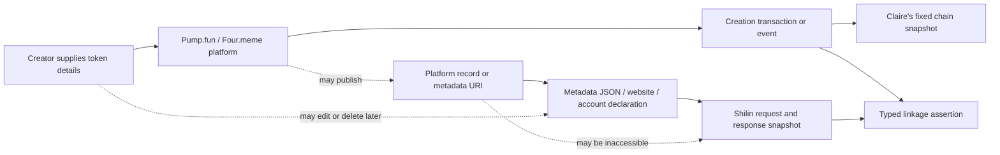

# Shilin off-chain pilot: data-generating process and reproducible pipeline

**Checkpoint:** 19 September 2026, 23:59 Beijing time. **Lead:** Shilin. **Joint integration:** Shilin and Claire. **Status:** Working pilot; actual results are reported in `release/validation_report.md` after execution. The manuscript target is a *Scientific Data* Data Descriptor, contingent on a separately designed publication cohort and technical validation.

## Dataset contribution and reuse

This component records what public metadata sources declared about tokens observed in Claire's on-chain snapshot. Its reusable objects are source requests, immutable response digests, field-level declarations, typed linkage assertions, and a coverage ledger that preserves failures and unmatched tokens. Claire's component independently describes on-chain transactions and decoded platform records; this component independently describes off-chain acquisition and declarations. Integration allows a reader to trace a declaration back to both a token creation record and a specific retrieved response. It does not establish who operates a website or account.

The existing Web3AI4IO study includes on-chain launchpad data and some presence flags, but its released on-chain scope does not contain this evidence-level off-chain linkage layer. The new release must quantify overlap with the prior data before submission. Researchers in digital markets, computational social science, and data provenance can use the linked records to study source coverage, link instability and reproducibility. Hypothesis tests about token success belong to a separate research article.

## Observation, population and selection

The fixed engineering window is **2026-09-14 12:00:00 UTC inclusive to 12:05:00 UTC exclusive** on Solana, BSC and Base. Claire's population is all included transaction records in that window. Our nested launch cohort selects records with `operation_type=creation`, `execution_effect=committed`, `decode_status=decoded` and nonempty chain-qualified `object_id`. We retain both event-level records and a unique-token count. The pilot is not a representative sample of all launches or complete token lifecycles. At present, the useful launch sources are Pump.fun and Four.meme; zero recognized Clanker creations in this window must be shown as zero observed, not zero activity.

One observation can be a creation event, unique token, source request, response snapshot, extracted declaration, candidate pair, evidence item, or typed relation. Each table states its own unit. A request failure is not an absent declaration. Current page content cannot be assumed to have existed at the creation time. `chain_event_time`, source-claimed timestamps, `retrieved_at`, and any verified historical availability time remain distinct.

## Editable data-generating process diagram

**Caption.** Solid arrows show an activity, recorded claim, or acquisition path; dotted arrows show a contingent or unobserved path. A chain event, metadata URI, response byte sequence and website URL are different observations. The chain time dates the on-chain declaration; retrieval time dates our off-chain observation. The arrows do not establish common ownership, human identity or a historical website state.

## Editable computational pipeline diagram

```mermaid
flowchart LR
  A[Claire pinned manifest and decoded Parquet] --> B[Select committed creation records]
  B --> C[Event queue and unique-token denominator]
  C --> D[Exact URI or chain + contract source request]
  D --> E[Request receipt and raw response hash]
  E --> F[Parse only observed fields]
  F --> G[Candidate, evidence, assertion and unresolved tables]
  G --> H[Coverage, time checks and validation report]
  H --> I[Off-chain and joint integration Colabs]
```

**Caption.** Each arrow is a reproducible transformation. Stage B reports selected and excluded counts; D reports attempts and failures; E verifies response digests; F records parse failures; G maintains primary and foreign keys; H checks time eligibility and denominators. An exact URI or chain-qualified contract is required for an accepted direct declaration. A similar name or ticker is only a candidate.

## Stage map

| Stage | Purpose and input | Output | Decision and check | Code |
|---|---|---|---|---|
| Queue | Select Claire's decoded platform creation records from pinned Parquet | Event-level `onchain_launch_cohort.parquet`, count waterfall | Keep committed/decoded only; retain duplicate and exclusion counts | `build_cohort.py` |
| Acquire | Request an exact on-chain URI or a platform record by complete BSC address | JSONL request receipts and local raw responses | Record HTTP failures, redirects, UTC retrieval times, bytes and SHA-256 | `collect_metadata.py`; Four.meme probe documented separately |
| Parse and link | Parse retrieved JSON and join through the on-chain URI | Snapshots, declarations, candidates, evidence, assertions, coverage | A declaration is tied to one response and pointer; later retrieval is not backdated | `process_linkage.py` |
| Validate | Recompute counts, keys, hashes and temporal eligibility | `release/validation_report.md` | Report actual results and limitations; preserve unmatched records | Validation notebook and release scripts |

Source access details and permissions are recorded in `release/rights_sources.csv`; input revisions, code versions, hashes and table definitions are recorded in the release manifest and dictionary. Local raw responses are excluded from public release until the source-specific redistribution status is cleared. Fixed released tables support offline replay of the integration; live source re-fetch is a separate mode whose results may differ.

The completed bounded run contains 116 creation events (61 Pump.fun, 55 Four.meme), 57 distinct Pump metadata URIs, 94 HTTP attempts, 57 parsed JSON snapshots, 39 URL-field declarations and 100 typed assertions. Twenty-nine Pump events have at least one covered URL field; 32 have none in the retrieved JSON. Three BSC address probes returned HTTP 403 and 52 BSC events were not attempted. The 13 source-side machine checks passed; the public snapshot has a separate hash/key verifier. These are technical coverage results, not population prevalence or evidence of URL ownership.

## Methodological references

The [DIVE Data Descriptor](https://www.nature.com/articles/s41597-026-07025-5) is a model for explaining data files, cleaning, labels and measured technical validation. [Multi-Chain Graphs of Graphs](https://proceedings.neurips.cc/paper_files/paper/2024/file/3205b048f9cc54b9f7963db0b0f52d53-Paper-Datasets_and_Benchmarks_Track.pdf), especially Section 3.2, motivates an explicit chain/token/transaction sampling frame and separate chain denominators. Its long transaction histories are not reproduced by this five-minute pilot. Current source documentation and actual request receipts control our implementation details.
